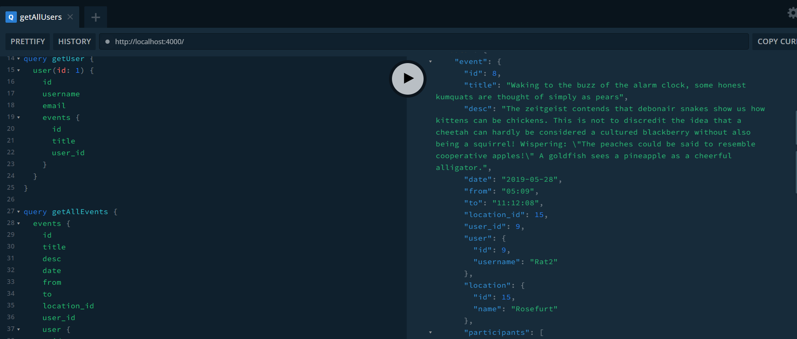

# GraphQL Party Events Server :star:

This project assignment has been prepared for the 'Kodluyoruz' GraphQL course. A sample GraphQL server where users can **view,update,delete and delete all options** for *events, event locations and event participants.*

---

